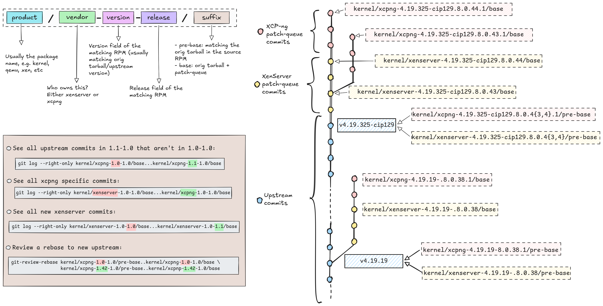
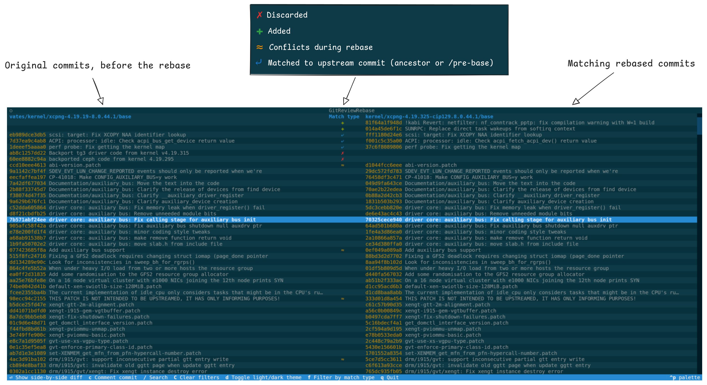
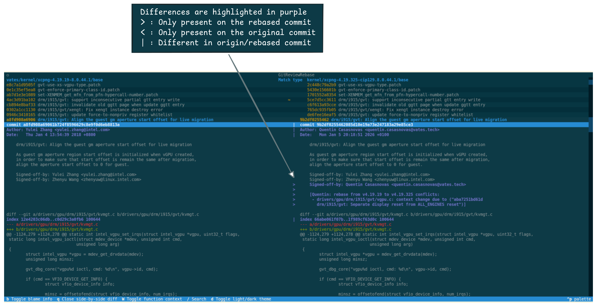
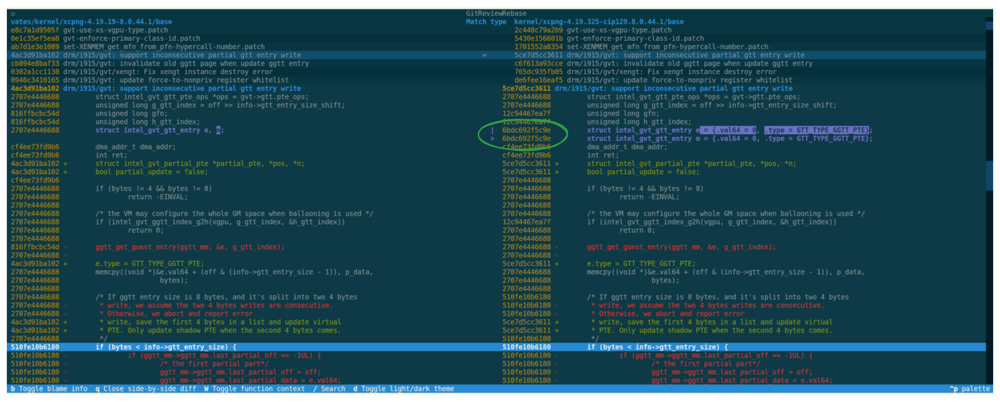
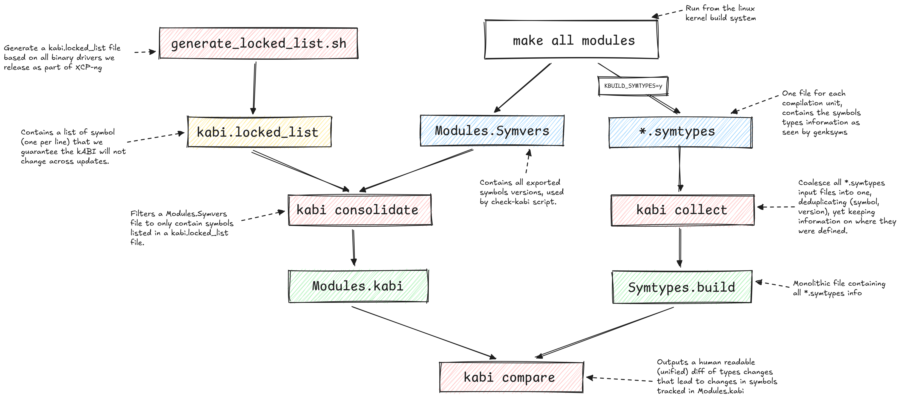

<!-- markdown-toc start - Don't edit this section. Run M-x markdown-toc-refresh-toc -->
**Table of Contents**

- [Introduction](#introduction)
  - [Branch convention](#branch-convention)
- [Pre-requisites](#pre-requisites)
  - [Get a working build environment](#get-a-working-build-environment)
  - [Install the kabi tool](#install-the-kabi-tool)
  - [Install the git-review-rebase tool](#install-the-git-review-rebase-tool)
- [Adding a new binary kernel module](#adding-a-new-binary-kernel-module)
  - [Pull and get all sub-modules](#pull-and-get-all-sub-modules)
  - [Add the new RPM repo as sub-module](#add-the-new-rpm-repo-as-sub-module)
  - [Refreshing the kabi.locked_list file](#refreshing-the-kabilocked_list-file)
- [Upgrading kernel to latest upstream](#upgrading-kernel-to-latest-upstream)
  - [Pre-requisites git repositories](#pre-requisites-git-repositories)
  - [Pre-requisites dev tooling](#pre-requisites-dev-tooling)
  - [Rebase the kernel to latest upstream](#rebase-the-kernel-to-latest-upstream)
    - [Check if the patch being applied was not already in your new onto branch:](#check-if-the-patch-being-applied-was-not-already-in-your-new-onto-branch)
      - [If yes](#if-yes)
      - [If no](#if-no)
    - [Create a branch from the rebased HEAD](#create-a-branch-from-the-rebased-head)
  - [Update the origin tarball](#update-the-origin-tarball)
    - [Download](#download)
    - [Verify the signature of your tarball](#verify-the-signature-of-your-tarball)
    - [Commit](#commit)
  - [Build the kernel RPMs](#build-the-kernel-rpms)
    - [Builds failures](#builds-failures)
      - [Incorrect conflict resolution](#incorrect-conflict-resolution)
      - [Kernel .config check fails](#kernel-config-check-fails)
      - [kABI breaking changes](#kabi-breaking-changes)
  - [Verify source RPM generates the same sources](#verify-source-rpm-generates-the-same-sources)
  - [Review your rebase](#review-your-rebase)
    - [Dropped commits on the rebase have a reason](#dropped-commits-on-the-rebase-have-a-reason)
    - [Patch-ids changes have a reason documented](#patch-ids-changes-have-a-reason-documented)
    - [Special care for added commits](#special-care-for-added-commits)
- [Adding an upstream patch to our patch-queue](#adding-an-upstream-patch-to-our-patch-queue)
  - [Cherry-pick the commit](#cherry-pick-the-commit)
  - [Update the RPM repo](#update-the-rpm-repo)
  - [Build the kernel RPMs](#build-the-kernel-rpms-1)
  - [Verify source RPM generates the same sources](#verify-source-rpm-generates-the-same-sources-1)
- [Incorporating XenServer patch-queue changes](#incorporating-xenserver-patch-queue-changes)
  - [Merging changes back in](#merging-changes-back-in)
  - [Build and verify](#build-and-verify)
- [Handling kABI breakage](#handling-kabi-breakage)
  - [Build before and after RPMs to get symtypes information](#build-before-and-after-rpms-to-get-symtypes-information)
  - [Using `kabi tui` to see all kABI changes](#using-kabi-tui-to-see-all-kabi-changes)
  - [Manually checking modified types](#manually-checking-modified-types)
    - [Unified diff of type changes](#unified-diff-of-type-changes)
    - [Manually Identifying breaking commit](#manually-identifying-breaking-commit)
    - [Manually checking holes and padding bytes with pahole](#manually-checking-holes-and-padding-bytes-with-pahole)
  - [Unknown to full definition](#unknown-to-full-definition)
  - [Struct field deletion](#struct-field-deletion)
  - [Struct field addition](#struct-field-addition)
    - [If there are extra holes that can be used](#if-there-are-extra-holes-that-can-be-used)
    - [If there are available padding bytes](#if-there-are-available-padding-bytes)
    - [If there are no holes](#if-there-are-no-holes)
      - [Code change](#code-change)
      - [Shadow live patching API](#shadow-live-patching-api)
  - [Struct field type change](#struct-field-type-change)
    - [No change in size of field](#no-change-in-size-of-field)
    - [Changes in size that fit a hole](#changes-in-size-that-fit-a-hole)
    - [Changes in size that do not fit a hole](#changes-in-size-that-do-not-fit-a-hole)
  - [Struct field re-ordering](#struct-field-re-ordering)
  - [Enum value added](#enum-value-added)
    - [That doesn't change subsequent values](#that-doesnt-change-subsequent-values)
    - [That does change subsequent values](#that-does-change-subsequent-values)
  - [Function prototype changes](#function-prototype-changes)
  - [Finalizing](#finalizing)

<!-- markdown-toc end -->

# Introduction

This repository contains information and tools in order to be able to
maintain the XCP-ng Linux kernel and other packages maintained by the
hypervisor & kernel team..  This README will guide you through different
maintenance activities like rebasing our patch-queue onto a new upstream
base, adding a new binary driver to the list of drivers, pulling changes
from the XenServer patch-queue, handling kABI breakage after an update to
the Linux kernel.


## Branch convention




We currently use a branch convention in the source code repositories
maintained by the Hypervisor & Kernel team at vates, where for each
released package (qemu, xen, linux), a corresponding source branch is
created in the form:

```
<product>/xcpng-<version>-<release>/base
```

Where product would be `kernel` for the Linux kernel, e.g.: `kernel/xcpng-4.19.325-cip129.8.0.44.1/base`.

For each `/base` branch, a corresponding `/pre-base` branch is created from
the upstream point where the patch-queue of our SRPM was applied onto.  As
such, our patch-queue can be found with the range `/pre-base../base`.

The branches are created by the
[git-import-srpm](https://github.com/xcp-ng/xcp/blob/quentin-git-import-srpm/scripts/git-import-srpm)
script run from within the SRPM repository.

We also have an [elixir instance]() with the source code indexed for all
past released RPMs.

# Pre-requisites

## Get a working build environment

```bash
git clone git@github.com:xcp-ng/xcp-ng-build-env.git
cd xcp-ng-build-env

# Build the docker image
./container/build.sh 8.3

# Install the xcp-ng-dev CLI
uv tool install --editable .
```
## Install the kabi tool

The script lives in this repository, to install:

```bash
cd scripts/kabi
pip install -e .
```

## Install the git-review-rebase tool

The script lives in this repository, to install:

```bash
cd scripts/git-review-rebase
pip install -e .
```

# Adding a new binary kernel module

## Pull and get all sub-modules

Let's make sure we work on top of main and that we have all the drivers
sub-modules properly initialized as a pre-requisite step.

```bash
git pull --rebase origin main
git submodule update --init
```

## Add the new RPM repo as sub-module

```bash
git submodule add <driver_repo> drivers/<driver_name>
git commit -s -m "<driver_name>: add to the list of submodules."
```

## Refreshing the kabi.locked_list file

As a new driver is added, we need to make sure we do not break the kABI it
relies in future kernel updates.

In order to do, we maintain a file listing all the symbols our binary
drivers are using from the linux kernel in
`kernel-abis/xcpng-8.3-kabi_lockedlist`.

We need to refresh this file to include symbols from the newly added
driver, the [generate_locked_list.sh](scripts/generate_locked_list.sh)
script does just that:


```bash

# Refresh the list of locked symbols
./scripts/generate_locked_list.sh ./kernel-abis/xcpng-8.3-kabi_lockedlist
git add ./kernel-abis/xcpng-8.3-kabi_lockedlist

# Refresh the types of information of locked symbols
kabi consolidate --kabi ./kernel-abis/xcpng-8.3-kabi_lockedlist --input ./kernel-abis/Symtypes.build-4.19.19 --output ./kernel-abis/Modules.kabi-4.19.19
git add kernel-abis/Modules.kabi-4.19.19

git commit -s -m "kernel-abis: refreshed the list of locked symbols due to <driver_name> addition."
```

# Upgrading kernel to latest upstream

## Pre-requisites git repositories

You will need two different repositories, one containing the source code,
and one containing the src RPM content that we will update as we are
rebasing the source code branches:

- [linux source repository](https://github.com/xcp-ng/linux)
- [source RPM repository](https://github.com/xcp-ng-rpms/kernel)

## Pre-requisites dev tooling

You should have installed `git-review-rebase` from the [Install the
git-review-rebase tool chapter](#install-the-git-review-rebase-tool), we'll
also need `git-import-srpm` which is present in the [main
xcp](https://www.github.com/xcp-ng/xcp) repository:

```bash
git clone git@github.com:xcp-ng/xcp.git
# Lives in scripts/git-import-srpm
```

Note that `git-import-srpm` is a simple bash script and doesn't need any
prior configuration before use, it is present in
`/path/to/xcp/repo/scripts/git-import-srpm`.

## Rebase the kernel to latest upstream

Find the last branch that was released,
e.g. `kernel/xcpng-4.19.19-8.0.44.1/base`, we'll use it as the source of
the rebased commits:

```bash
cd /path/to/source/repo

# Last released branch
prev_branch=$(git branch -r --list origin/kernel/xcpng\*/base | sort -V | tail -n 1)

# Extra ^0 suffix to reference the commit and make sure original branch isn't updated
git rebase ${prev_branch%/base}/pre-base ${prev_branch}^0 --onto v4.19.325
```

> [!NOTE]
>
> Replace `v4.19.325` with the upstream tag you are rebasing onto

As you are rebasing, you will get conflicts.  For each conflict:

### Check if the patch being applied was not already in your new onto branch:

An easy way to check this is to use the title of the failing patch:

```bash
git log --oneline --right-only --grep "<title_goes_here>" ${prev_branch}...HEAD
```

#### If yes

Drop the patch `git rebase --skip` and comment the patch from the list of
patches in the `SPECS/kernel.spec` file, referencing the upstream sha1 of
the commit, e.g.:

```diff
diff --git a/SPECS/kernel.spec b/SPECS/kernel.spec
index 181b3a467d87..5997a384f4ef 100644
--- a/SPECS/kernel.spec
+++ b/SPECS/kernel.spec
@@ -79,23 +79,23 @@ Provides: kernel-%{_arch} = %{version}-%{release}

 Source0: kernel-4.19.19.tar.gz
 Source1: kernel-x86_64.config
 Source2: macros.kernel
-Patch0: 0001-Fix-net-ipv4-do-not-handle-duplicate-fragments-as-ov.patch
-Patch1: 0001-xen-privcmd-allow-fetching-resource-sizes.patch
-Patch2: 0001-block-genhd-add-groups-argument-to-device_add_disk.patch
-Patch3: 0002-nvme-register-ns_id-attributes-as-default-sysfs-grou.patch
-Patch4: 0001-mm-zero-remaining-unavailable-struct-pages.patch
-Patch5: 0002-mm-return-zero_resv_unavail-optimization.patch
-Patch6: 0001-mm-page_alloc.c-fix-uninitialized-memmaps-on-a-parti.patch
+# Patch0: 0001-Fix-net-ipv4-do-not-handle-duplicate-fragments-as-ov.patch: c763a3cf502 Fix "net: ipv4: do not handle duplicate fragments as overlapping"
+# Patch1: 0001-xen-privcmd-allow-fetching-resource-sizes.patch: d8099663adc9 xen/privcmd: allow fetching resource sizes
+# Patch2: 0001-block-genhd-add-groups-argument-to-device_add_disk.patch: 1bf6a186c452 block: genhd: add 'groups' argument to device_add_disk
+# Patch3: 0002-nvme-register-ns_id-attributes-as-default-sysfs-grou.patch: ea7ac82cf4d8 nvme: register ns_id attributes as default sysfs groups
+# Patch4: 0001-mm-zero-remaining-unavailable-struct-pages.patch: 9ac5917a1d28 mm: zero remaining unavailable struct pages
+# Patch5: 0002-mm-return-zero_resv_unavail-optimization.patch: f19a50c1e3ba mm: return zero_resv_unavail optimization
+# Patch6: 0001-mm-page_alloc.c-fix-uninitialized-memmaps-on-a-parti.patch: 0a69047d8235 mm/page_alloc.c: fix uninitialized memmaps on a partially populated last section
```

#### If no

Manually resolve the conflicts and make sure to add a comment in the commit
description to explain the reason of the conflict, as well as a reference
to the commit that introduced the conflict `git add -u; git commit` e.g:

```text
[Quentin: rebase from v4.19.19 to v4.19.325 conflicts:
 - path/to/file/with/conflict.c: <sha1> ("<commit title>") changed the context
   by <doing something>.]
```

Once the conflict is resolved and committed, generate a new patch with `git
format-patch -1` and copy it to the `SOURCES/` directory in the rpm repo,
add a suffix to the patch file referencing the new onto point, e.g.:

```bash
cp 0001-xen-blkback-fix.patch /path/to/rpm/repo/SOURCES/0001-xen-blkback-fix-rebase-to-v4.19.325.patch
                                                                             ^^^^^^^^^^^^^^^^^^^
```

Then update the `PatchXXXX 0001-xen-blkback-fix.patch` line in the
`SPECS/kernel.spec` file, e.g.:

```diff
diff --git a/SPECS/kernel.spec b/SPECS/kernel.spec
index 181b3a467d87..5997a384f4ef 100644
--- a/SPECS/kernel.spec
+++ b/SPECS/kernel.spec
@@ -162,6 +162,6 @@  Patch75: 0002-gfs2-clean_journal-improperly-set-sd_log_flush_head.patch
 Patch76: 0001-gfs2-Replace-gl_revokes-with-a-GLF-flag.patch
 Patch77: 0005-gfs2-Remove-misleading-comments-in-gfs2_evict_inode.patch
-Patch78: 0006-gfs2-Rename-sd_log_le_-revoke-ordered.patch
+Patch78: 0001-gfs2-Rename-sd_log_le_-revoke-ordered-rebase-325.patch
 Patch79: 0007-gfs2-Rename-gfs2_trans_-add_unrevoke-remove_revoke.patch
 Patch80: 0001-iomap-Clean-up-__generic_write_end-calling.patch
```

And carry on your rebase with `git rebase --cont`.

### Create a branch from the rebased HEAD

Once your initial rebase is done, create a branch from your HEAD commit:

```bash
cd /path/to/source/repo
git checkout -B <your-name>-rebase-to-<upstream_tag>
```

## Update the origin tarball

### Download

Because the starting point of the patch-queue is different, you'll need to
download a tarball matching the onto point you've used, as well as its
signature file, e.g.:

- [linux-4.19.325.tar.gz](https://cdn.kernel.org/pub/linux/kernel/v4.x/linux-4.19.325.tar.gz)
- [linux-4.19.325.tar.sign](https://cdn.kernel.org/pub/linux/kernel/v4.x/linux-4.19.325.tar.sign)

### Verify the signature of your tarball

```bash
gunzip --keep linux-4.19.325.tar.gz
gpg --verify linux-4.19.325.tar.sign linux-4.19.325.tar
```

You might need to import Linus' and Greg KH's keys first:

```bash
gpg --locate-keys torvalds@kernel.org gregkh@kernel.org
```

Double check the key signatures you've imported with [kernel.org
signatures](https://www.kernel.org/category/signatures.html)

For Ulrich Hecht, you can find his public key through the [Linux foundation
CIP
Wiki](https://wiki.linuxfoundation.org/civilinfrastructureplatform/cipkernelmaintenance),
current link as of February 2026 is
[here](https://git.kernel.org/pub/scm/docs/kernel/pgpkeys.git/plain/keys/36A3BADB36B27332.asc).

You can download it locally and then import it into your `gpg` keyring:

```bash
gpg --import < ~/Downloads/36A3BADB36B27332.asc
```

### Commit

Once everything is verified, you can add the unmodified tarball into the
SOURCES directory and update the `Source0` line of the `SPECS/kernel.spec`
file to point to it.  Also change the `usrver`, `package_srccommit` and
`Version` variable, e.g.:

```diff
diff --git a/SPECS/kernel.spec b/SPECS/kernel.spec
index 181b3a467d87..5997a384f4ef 100644
--- a/SPECS/kernel.spec
+++ b/SPECS/kernel.spec
@@ -1,8 +1,8 @@
 %global package_speccommit ccb8ee3c01ade60b0ee7a22436d4b25d84702ae4
-%global usver 4.19.19
+%global usver 4.19.325
 %global xsver 8.0.44
 %global xsrel %{xsver}%{?xscount}%{?xshash}
-%global package_srccommit refs/tags/v4.19.19
+%global package_srccommit refs/tags/v4.19.325
 %define uname 4.19.0+1
 %define short_uname 4.19
 %define srcpath /usr/src/kernels/%{uname}-%{_arch}
@@ -36,7 +36,7 @@

 Name: kernel
 License: GPLv2
-Version: 4.19.19
+Version: 4.19.325
 Release: %{?xsrel}.1%{?dist}
 ExclusiveArch: x86_64
@@ -79,23 +79,23 @@ Provides: kernel-%{_arch} = %{version}-%{release}
 Requires(post): coreutils kmod
 Requires(posttrans): coreutils dracut kmod

-Source0: kernel-4.19.19.tar.gz
+Source0: linux-4.19.325.tar.gz
 Source1: kernel-x86_64.config
 ```

Commit as usual the resulting changes.

> [!Note]
>
> XenServer orig tarballs are somewhat slightly modified from the ones on
> kernel.org, and will untar inside `kernel-<Version>` whereas tarballs
> from kernel.org will untar inside `linux-<Version>`.  You can specify the
> format on the `%autosetup` line from the `%prep` step, using the `-n`
> option, e.g.:
>
> ```diff
> diff --git a/SPECS/kernel.spec b/SPECS/kernel.spec
> index 5997a384f4ef..1778746e2c86 100644
> --- a/SPECS/kernel.spec
> +++ b/SPECS/kernel.spec
> @@ -787,7 +787,7 @@ Provides: python2-perf
>  %{pythonperfdesc}
>
>  %prep
> -%autosetup -p1
> +%autosetup -p1 -n linux-%{version}
>  %{?_cov_prepare}
>
>  %build
> ```

## Build the kernel RPMs

We should be ready to start building at this point:

```bash
cd /path/to/rpm/repo
xcp-ng-dev container build 8.3 ./
```

### Builds failures


#### Incorrect conflict resolution

Go back to the source repository, find the commit that introduced the build
failure, and rework it, e.g.:

```bash

# Use git log pickaxes to find incriminating commit
git log --oneline -G<line_content> <prev_branch>..<new_branch> -- path/to/file/with/compiler/error.c

# Modify the commit
git rebase -i <bad_commit>^
# Mark the first commit as edit, save the git rebase TODO

# Fix the code and continue the rebase, make sure to add a comment to the
# commit description explaining why you had to make the change
git add -u
git commit --amend

# Generate a new patch
git format-patch -1

# Continue the rebase
git rebase --cont
```

Copy the new patches to the `SOURCES` directory in your RPM repo like when
you [resolved conflict](#if-no) and update the `SPECS/kernel.spec`
accordingly.  `git add` the new patches as well as your `SPECS/kernel.spec`
changes, and re-run a build.  Repeat until it succeeds.

> [!NOTE]
>
> You can get faster build/change/test iterations by adding `--no-exit` to
> the `xcp-ng-dev container build` CLI and copy/pasting the `make` command
> line that is used to build the kernel so that you benefit from iterative
> builds.  If you do that, you'll still need a final run xcp-ng-dev
> container build to make sure everything is good to go from scratch.

#### Kernel .config check fails

A source of errors when building the RPM is when the defconfig has changed,
to update it you can use `--no-exit` to your `xcp-ng-dev container build`
command line to be dropped inside the container and then, in another
terminal find the container id and copy the config file from it:

```bash
# Get the docker id
docker ps

# Copy the .config
docker cp <container_id>:/home/builder/rpmbuild/BUILD/linux-4.19.325/.config /path/to/rpm/repo/SOURCES/kernel-x86_64.config

```

Audit the changes to the `.config` file, and create a separate commit for
it.  This will need to be carefully reviewed as to make sure we're not
adding or removing any important kernel config.  You can then try again to
build the RPM.


#### kABI breaking changes

Once the kernel is built, the `check-kabi` script will compare the
`Modules.symvers` file with the `Module.kabi` file included in the source
and will fail if any symbols were changed.  You can follow the chapter
[Handling kABI breakage](#handling-kabi-breakage) to neutralize those
changes.

## Verify source RPM generates the same sources

Once your rebase is done and your RPM builds just fine, it is important to
verify that your src RPM will generate the same sources.

```bash
cd /path/to/rpm/repo
git commit -s -m "kernel: rebase to v4.19.325"
/path/to/xcp/repo/scripts/git-import-srpm HEAD
```

This should create a new branch, you can then use `git diff
<your_name>-rebase-4.19.325 <newly_imported_branch>` to make sure there are
zero diffs.

## Review your rebase

You should have installed `git-review-rebase` from the pre-requisites
steps, now is time to use it.



You can press `enter` when in the main view to see a side-by-side diff of commits:



You can toggle the blame output when in the diff view by pressing `b`,
allows to see which commit introduced the conflict:



Go check its [README](https://github.com/xcp-ng/git-review-rebase) for more information.

### Dropped commits on the rebase have a reason

There may be commits that were present on the previous branch that simply
do not apply on top of the new onto point.  These are not to be confused
with commits that were present in the initial rebased range and that were
dropped during the rebase because an equivalent commit was present as
ancestor of the new onto point, as those should not show as dropped in the
`git-review-rebase` TUI, instead they'll show as matched to their
equivalent upstream commit.

Dropped commits need to have a comment added to them through the
`git-review-rebase` TUI (which is using `git notes` internally to save/show
them) explaining why a commit disappeared from the rebase, e.g.:

```text
commit ab8c1257dd2213bbf9b0ef603bc50398d6bd0e80
Author: Thierry Escande <thierry.escande@vates.tech>
Date:   Wed Jun 12 14:47:11 2024 +0200

    Backport tg3 driver code from kernel v4.19.315

Notes:
    Quentin: Latest tg3 driver included in v4.19.325 rebase.
```

Here there were no single commit to be matched in the new branch because
the commit from the previous branch was a massive squash, as such it
appears as "dropped", and the reason is documented.

### Patch-ids changes have a reason documented

Most patch-id changes imply there was a conflict during the rebase - as
such, a clear explanation as to what was the conflict as well _why_ there
was a conflict (i.e. pointing to the commit in the new onto that led to
the conflict) MUST be present in the commit description to facilitate
reviews and document the problems.

The reviewer will be able to "replay" the rebase of the particular commit
using `git-review-rebase` to compare their resolution with yours.

Don't hesitate to use the blame output in the `git-review-rebase` command
to find upstream commits causing the conflicts.

### Special care for added commits

> [!WARNING]
>
> Seeing an added commit at this point of the process should not happen -
> if it does it is very likely pointing to a commit that was applied AND
> reverted (or partially reverted) on the new onto point, allowing it to be
> applied again.  Reverts are here for a reason, so this needs
> investigation and likely dropping the commit on the rebase because it was
> either deemed buggy or was superseded by a commit fixing differently
> (hopefully in a better way) the same issue.

# Adding an upstream patch to our patch-queue

Sometimes a fix or improvement from a newer upstream kernel needs to be
backported to our current kernel version.  This chapter describes how to
cherry-pick such a commit and integrate it into our patch-queue.

## Cherry-pick the commit

Find the latest `/base` branch and create a working branch on top of it:

```bash
cd /path/to/source/repo

base_branch=$(git branch -r --list origin/kernel/xcpng\*/base | sort -V | tail -n 1)
git checkout -B <your-name>/add-<short-description> ${base_branch}
```

Cherry-pick the upstream commit (make sure to use -x):

```bash
git cherry-pick -x <upstream-sha1>
```

If the cherry-pick results in conflicts, resolve them and make sure to add
a comment in the commit description explaining the reason for the conflict,
e.g.:

```text
[Quentin: cherry-pick onto v4.19.325 conflicts:
 - path/to/file.c: <sha1> ("<commit title>") changed the context
   by <doing something>.]
```

Generate the patch file once done:

```bash
git format-patch -1
```

## Update the RPM repo

Copy the patch to the `SOURCES/` directory of the RPM repo:

```bash
cp 0001-<patch-name>.patch /path/to/rpm/repo/SOURCES/
```

Add a new `Patch1NNN:` line to `SPECS/kernel.spec`, incrementing the patch
number from the last existing entry within the block for the XCP-ng
patch-queue (which comes after the XenServer patch-queue):

```diff
diff --git a/SPECS/kernel.spec b/SPECS/kernel.spec
index 1778746e2c86..61909253c295 100644
--- a/SPECS/kernel.spec
+++ b/SPECS/kernel.spec
@@ -720,7 +721,7 @@ Source5: prepare-build
 # Patch1000: ceph.patch: already included in v4.19.325
 # Patch1001: tg3-v4.19.315.patch: already included in v4.19.325
 # Patch1002: 0001-perf-probe-Fix-getting-the-kernel-map.patch: 37c6f8089806 perf probe: Fix getting the kernel map
 Patch1003: 0001-ACPI-processor-idle-Check-acpi_bus_get_device-return.patch
 # Patch1004: 0001-scsi-target-Fix-XCOPY-NAA-identifier-lookup.patch: fff1180d24e6 scsi: target: Fix XCOPY NAA identifier lookup
+Patch1005: 0001-<patch-name>.patch
 ```

Commit the result:

```bash
cd /path/to/rpm/repo
git add SOURCES/0001-<patch-name>.patch SPECS/kernel.spec
git commit -s -m "kernel: <short-description>"
```

## Build the kernel RPMs

```bash
xcp-ng-dev container build 8.3 ./
```

If the build fails due to a conflict resolution issue, refer to [Incorrect
conflict resolution](#incorrect-conflict-resolution).

Once the kernel is built, `check-kabi` will compare the exported symbols
against our locked list.  If it reports breakage, follow
[Handling kABI breakage](#handling-kabi-breakage) before proceeding.

## Verify source RPM generates the same sources

```bash
/path/to/xcp/repo/scripts/git-import-srpm HEAD
```

Use `git diff <your-branch> <newly_imported_branch>` to verify there are
zero diffs.

# Incorporating XenServer patch-queue changes

Our `SPECS/kernel.spec` contains two blocks of patches: XenServer's
(numbered `Patch0` onwards) followed by ours (numbered `Patch1000`
onwards).  When XenServer releases a new kernel SRPM, their patch-queue
changes and we need to incorporate those changes into our branch.

The following assumes the new XenServer SRPM is already imported as the
`XS-8.3` branch in the SRPM repo.

## Merging changes back in

```bash
cd /path/to/source/rpm/repo
git merge origin/master
```

If you're lucky, XenServer folks added new patches on top of their current
patch-queue, such that the numbering for all the existing patches remain
unchanged.  In this case, the merge should be pretty straightforwards and
without much difficult conflicts.

OTOH, if they've added new patches in the middle of the workqueue, that's
where things get a little trickier as you will get pretty disgusting
conflicts.  Resolve all conflicts that are _not_ related to the Patch
lines, then discard any conflicts in those Patch lines (keep as they were
before the cherry-pick), then manually copy/paste the extra `Patch` lines.
You can use the following one-liner to get the list of added `Patch` lines
like:

``` bash
cd /path/to/source/rpm/repo/
git diff origin/XS-8.3^- --word-diff --word-diff-regex='[^[:space:]]|Patch[0-9]+:' -- SPECS \
	| grep '^{+Patch.*+}$' \
	| sed -e 's/+}$//' -e 's/^{//'
```

All the Patch indexes can now be "offset" with the
[change_spec_patch_indexes.sh](./scripts/change_spec_patch_indexes.sh)
script, for example, if the above `git diff` command gives you:

``` diff
+Patch444: 0002-SUNRPC-Remove-the-bh-safe-lock-requirement-on-xprt-t.patch
+Patch445: 0003-SUNRPC-Replace-direct-task-wakeups-from-softirq-cont.patch
+Patch446: 0004-SUNRPC-Replace-the-queue-timer-with-a-delayed-work-f.patch
+Patch447: 0001-nbd-fix-possible-sysfs-duplicate-warning.patch
+Patch448: 0001-nbd-protect-cmd-status-with-cmd-lock.patch
+Patch449: 0001-nbd-handle-racing-with-error-ed-out-commands.patch
+Patch450: 0001-nbd-fix-a-block_device-refcount-leak-in-nbd_release.patch
+Patch451: 0001-nbd-Aovid-double-completion-of-a-request.patch
+Patch452: 0001-nbd-don-t-handle-response-without-a-corresponding-re.patch
+Patch453: 0001-nbd-make-sure-request-completion-won-t-concurrent.patch
```

That's **10** extra patches, starting at `Patch444`, so you'd run:

``` bash
./scripts/change_spec_patch_indexes.sh /path/to/source/rpm/repo/SPECS/kernel.spec 444 10
```

The script should be smart enough to fix all indexes for you as well as
ignore patch indexes that are specific to XCP-ng.

You can then git add and git commit.

## Build and verify

Once all changes are incorporated, build the RPMs:

```bash
cd /path/to/srpm/repo
xcp-ng-dev container build 8.3 ./
```

If the build fails, refer to [Incorrect conflict
resolution](#incorrect-conflict-resolution).

Once built, `check-kabi` will verify the symbol exports and it should not
fail at this step given XenServer folks guarantee a stable kABI.

Finally, verify that the source RPM can be imported as a source branch
cleanly using the `git-import-srpm` script:

```bash
git commit -s -m "kernel: incorporate XS <xs-version> changes"
/path/to/xcp/repo/scripts/git-import-srpm HEAD
```

# Handling kABI breakage

> [!NOTE]
>
> [README.txt](scripts/kabi/README.txt) contains an introduction
> on genksyms and the kabi tool - if you are not familiar with those you
> should start there.
>
> This high-level diagram shows the different files involved in the process:
> 

Our current policy with regards to kABI changes is that it MUST not change
any kABI required by binary modules we are shipping (otherwise, said
modules need to be rebuilt, and a new install ISO generated).

Before we dive into the various ways to neutralize kABI changes, here are a
handy git aliases you can add to commit with information on what commit we
are neutralizing the kabi for:

```config
[alias]
	kabi = "!f() { git commit -s -e -m \"!kabi $(git title $1)\n\n\nFixes: $(git log --format=\"%h (\\\"%s\\\")\" --no-decorate -1 $1)\"; }; f"
	ol = "!f() { git log \"--format=%h (\\\"$(git title $1)\\\")\" --no-walk $1; }; f"
	rkabi = "!f() { git revert --no-edit $1; git commit --amend -s -e -m \"!kabi Revert: $(git log --format=%s -1 $1)\n\n\nReverts: $(git log --format=\"%h (\\\"%s\\\")\" --no-decorate -1 $1)\"; }; f"
	title = "!f() { git log --format=%s --no-walk $@ | awk '{ if (length($0) > 80) print substr($0, 1, 80) \"…\"; else print }' ; }; f"
	xsel = "!f() { git ol $1 | tr -d '\n' | xsel --clipboard  --input; }; f"
```

You can then simply run `git kabi <guilty_commit_sha1>` to `git commit`
with a templated commit description, or `git rkabi <guilty_commit_sha1>`
for the same effect but actually reverting the commit introducing the kABI
change.

## Build before and after RPMs to get symtypes information

Now, in order to know exactly what's changed, we'll need two builds of the
kernel RPMs, one before the change (rebase, or patch addition to our
patch-queue), and one after, with `KBUILD_SYMTYPES=y`, so that metadata
about types are saved and we can use them to infer which commits introduced
the kABI changes.

> [!NOTE]
>
> The Symtypes file for the currently released kernel should already be
> present in the `kernel-abis/` directory so this step might be skippable.
> OTOH, doing it is not that long and allows you to have a `vmlinux.o` from
> the currently released kernel which will be useful along with `pahole` to
> correct kABI changes.

Add `export KBUILD_SYMTYPES=y` before the `make` command in the `%build`
step, then build:

```bash
cd /path/to/rpm/repo/

git checkout origin/master
sed -i 's/^%build$/%build\nexport KBUILD_SYMTYPES=y\n/' SPECS/kernel.spec
xcp-ng-dev container build 8.3 ./
```

Collect all the types information with:

```bash
kabi collect /path/to/rpm/repo/BUILD/kernel-4.19.19 --output ./kernel-abis/Symtypes.build-4.19.19

```

Save the build directory for later (it contains vmlinux.o which we will
need to get dwarf information on types):

```bash
cp -r /path/to/rpm/repo/BUILD/kernel-4.19.19 /tmp/
```

Repeat the whole process for the rebased branch.

## Using `kabi tui` to see all kABI changes


The `kabi tui` is an interactive frontend that helps in identifying kABI
changes.  It needs a few inputs in order to present information on changed
types, pahole outputs (useful to find information about holes and padding),
commits that introduced the kABI change:

- `--repository`: Path to the linux repository, e.g. `--repository ~/repos/linux`
- `--rev-list`: Git range before/after rebase, e.g. `--rev-list v4.19.19..v4.19.325-cip129`
- `--old-vmlinux/--new-vmlinux`: Path to an unstripped vmlinux.o file, e.g. `--old-vmlinux vmlinux-4.19.19.o`
- `--locked-file`: Path to the `kabi.locked_list`
- `OLD_MODULES.KABI NEW_MODULES_KABI`: Path to `Symtypes.build|Modules.kabi` files for the base (old) and rebased (new) version of symbol types

Example run:

```bash
kabi tui --repository ~/vates/repos/linux                       \
         --rev-list v4.19.325..v4.19.325-cip129                 \
	     --old-vmlinux ./kernel-abis/vmlinux-4.19.325.o         \
		 --new-vmlinux ./kernel-abis/vmlinux-4.19.325-cip129.o  \
		 --locked-file ./kernel-abis/xcpng-8.3-kabi_lockedlist  \
		 ./kernel-abis/{Modules.kabi-4.19.325,Symtypes.build-4.19.325-cip129}
```

## Manually checking modified types

This chapter describes how to manually check the type changes and identify
guilty commits.  Generally, the `kabi tui` frontend is better suited for
this work as it will automate most of those steps, but this is given for
reference.

### Unified diff of type changes

This uses the `kabi` tool to get a text output of all the changed types

```bash
kabi compare --no-print-symbol ./kernel-abis/Modules.kabi-4.19.19 ./kernel-abis/Modules.kabi-4.19.325
```

Typical output will look like this:

```diff
--- struct netns_ipv4 - Baseline
+++ struct netns_ipv4 - Comparison
@@ -52,6 +52,7 @@
        int sysctl_tcp_l3mdev_accept;
        int sysctl_tcp_mtu_probing;
        int sysctl_tcp_base_mss;
+       int sysctl_tcp_min_snd_mss;
        int sysctl_tcp_probe_threshold;
        u32 sysctl_tcp_probe_interval;
        int sysctl_tcp_keepalive_time;
@@ -128,4 +129,5 @@
        struct fib_notifier_ops *ipmr_notifier_ops;
        unsigned int ipmr_seq;
        atomic_t rt_genid;
+       siphash_key_t ip_id_key;
 }

--- struct cxgbi_sock - Baseline
+++ struct cxgbi_sock - Comparison
@@ -40,6 +40,7 @@
        struct sk_buff_head receive_queue;
        struct sk_buff_head write_queue;
        struct timer_list retry_timer;
+       struct completion cmpl;
        int err;
        rwlock_t callback_lock;
        void *user_data;
```

Each change will require either a kABI fix, if possible, or reverting the
patch that introduced the change.

### Manually Identifying breaking commit

The fastest way is to first identify where the symbol definition is coming
from, e.g. for `struct cxgbi_sock` above, we'd:

```bash
cd /path/to/source/repo/
git grep -l 'struct cxgbi_sock {'
drivers/scsi/cxgbi/libcxgbi.h
```

Then use git log pickaxe to find which commit added or removed the field:

```bash
$ git log --oneline -G 'completion cmpl;'  --right-only ${prev_branch}..HEAD -- drivers/scsi/cxgbi/libcxgbi.h
4c3b23e90307 scsi: cxgb4i: add wait_for_completion()
```

The easiest way is obviously to revert the infringing commit, but some
tricks might be possible to avoid this last resort measure, check next
chapters to see if it's possible depending on the change.

### Manually checking holes and padding bytes with pahole

`man pahole` is your friend here, but the gist of it is that you can run
the following command to see how the struct are laid out in memory:

```bash
pahole -C <type_name> /path/to/vmlinux.o
```

You can also add the `-I` flag so that `pahole` will tell you where the
struct definition lives (path to the header file).

## Unknown to full definition

Sometimes a type definition hasn't really changed, but some compilation
units which only had a forward declaration suddenly become aware of the
full definition - this usually happens when a header file is added to a
compilation unit.

For example, commit `7c43f84efd6d ("driver core: Establish order of
operations for device_add and device_del via bit…")` includes `linux/mm.h`
in `fs/sysfs/file.c` which causes the following symbols to have a kABI
change:
- `sysfs_create_file_ns`
- `sysfs_remove_bin_file`
- `sysfs_remove_file_ns`

This is caused by the `struct dev_pagemap` to become fully defined, this is
presented as the following diff in `kabi tui`:

```diff
--- struct dev_pagemap
+++ struct dev_pagemap
@@ -1,3 +1,12 @@
 struct dev_pagemap {
-   UNKNOWN
+   typedef dev_page_fault_t page_fault;
+   typedef dev_page_free_t page_free;
+   struct vmem_altmap altmap;
+   typedef bool altmap_valid;
+   struct resource res;
+   struct percpu_ref *ref;
+   void (*kill) (struct percpu_ref *);
+   struct device *dev;
+   void *data;
+   enum memory_type type;
```

A careful reader will have noticed that `struct dev_pagemap` is _not_
defined inside `linux/mm.h`, but inside `include/linux/memremap.h`, but
because `memremap.h` is included in `mm.h`, this causes kABI breakge.

Most of the time, those kABI changes are easy to neutralize because we can
simply hide the new header inclusion from `genksyms`, e.g.:

```diff
commit 2427dabb9445232d7ae0004846d45b66f0c3c628
Author: Quentin Casasnovas <quentin.casasnovas@vates.tech>
Date:   Fri Feb 27 14:04:01 2026 +0100

    !kabi sysfs: Add sysfs_emit and sysfs_emit_at to format sysfs output

    Made sure the `struct dev_pagemap` hasn't changed during the rebase from
    v4.19.19 to v4.19.325-cip129 through pahole.

    Fixes: cb1f69d53ac8 ("sysfs: Add sysfs_emit and sysfs_emit_at to format sysfs output")
    Signed-off-by: Quentin Casasnovas <quentin.casasnovas@vates.tech>

diff --git a/fs/sysfs/file.c b/fs/sysfs/file.c
index e7c7d28c3fc6..a56520b67158 100644
--- a/fs/sysfs/file.c
+++ b/fs/sysfs/file.c
@@ -15,8 +15,14 @@
 #include <linux/list.h>
 #include <linux/mutex.h>
 #include <linux/seq_file.h>
+#ifndef __GENKSYMS__
+/*
+ * Added in 7c43f84efd6d ("driver core: Establish order of operations for
+ * device_add and device_del via bitflag") and causes struct dev_pagemap to
+ * be fully defined, which changes the kABI of sysfs_* exported symbols.
+ */
 #include <linux/mm.h>
-
+#endif
 #include "sysfs.h"
 #include "../kernfs/kernfs-internal.h"

```

> [!WARNING]
>
> It is important to make sure that the type definition has _not_ changed
> during you rebase, because the kABI change could be two folds (from
> forward to fully declared _AND_ with some internal changes).


## Struct field deletion

A field deletion is usually safe to ignore, so long as it doesn't change
the offsets of subsequent fields.  If it does change offsets, it is fine to
simply add it back and no code will use it.

Example:

```diff
--- struct cfs_bandwidth
+++ struct cfs_bandwidth
@@ -4,8 +4,6 @@
    typedef u64 quota;
    typedef u64 runtime;
    typedef s64 hierarchical_quota;
-   typedef u64 runtime_expires;
-   int expires_seq;
    short idle;
    short period_active;
    struct hrtimer period_timer
```

Commit deleting the field `502bd151448c ("sched/fair: Fix low cpu usage
with high throttling by removing expiration of cpu-local slices")`.

In this case those fields are really internal to the fair scheduler and are
not supposed to be used outside.  In this case, it is safe to neutralize
the kABI change by adding the fields back, to avoid subsequent fields from
changing offsets.  As a defensive measure from any code using them, we will
rename them so that we'd get build errors, and leave their name untouched
for `genksyms`, such that no kABI changes are recorded by `genksyms`.

The fix:
```diff
commit c327be40dc1cb1f4fc11799929b27f8035146a65
Author: Quentin Casasnovas <quentin.casasnovas@vates.tech>
Date:   Tue Feb 24 10:36:00 2026 +0100

    !kabi sched/fair: Fix low cpu usage with high throttling by removing expiration of cpu-local slices

    Fixes: 502bd151448c ("sched/fair: Fix low cpu usage with high throttling by removing expiration of cpu-local slices")
    Signed-off-by: Quentin Casasnovas <quentin.casasnovas@vates.tech>

diff --git a/kernel/sched/sched.h b/kernel/sched/sched.h
index 55e695080fc6..24dc6c2f449e 100644
--- a/kernel/sched/sched.h
+++ b/kernel/sched/sched.h
@@ -337,6 +337,15 @@ struct cfs_bandwidth {
        u64                     runtime;
        s64                     hierarchical_quota;

+#ifdef __GENKSYMS__
+       typedef u64 runtime_expires;
+       int expires_seq;
+#else
+       /* Removed in: 502bd151448c sched/fair: Fix low cpu usage with high throttling by removing expiration of cpu-local slices */
+       typedef u64 __unused_runtime_expires;
+       int __unused_expires_seq;
+#endif
+
        short                   idle;
        short                   period_active;
        struct hrtimer          period_timer;
```

## Struct field addition

Struct field additions are usually the more complex to neutralize because
they tend to change offsets of all subsequent fields, unless you're lucky
and they end up right on a hole (check the `pahole` view).

### If there are extra holes that can be used

Example with commit `53441f8e0185 ("PCI/ACPI: Fix runtime PM ref imbalance
on Hot-Plug Capable ports")`

```diff
--- struct pci_dev
+++ struct pci_dev
@@ -77,6 +77,7 @@
    unsigned int is_virtfn : 1;
    unsigned int reset_fn : 1;
    unsigned int is_hotplug_bridge : 1;
+   unsigned int is_pciehp : 1;
    unsigned int shpc_managed : 1;
    unsigned int is_thunderbolt : 1;
    unsigned int __aer_firmware_first_valid : 1;
```

In this example, the commit added an extra bit-field, used by the core PCI
sub-system.  We can note from the `pahole` view that there was a 5 bits
hole inside the `struct pci_dev`:

```C
struct pci_dev {
    /* ... */

    unsigned int               reset_fn:1;           /*  2000:31  4 */
    unsigned int               is_hotplug_bridge:1;  /*  2004: 0  4 */
    unsigned int               shpc_managed:1;       /*  2004: 1  4 */
    unsigned int               is_thunderbolt:1;     /*  2004: 2  4 */
    unsigned int               __aer_firmware_first_valid:1; /*  2004: 3  4
    unsigned int               __aer_firmware_first:1; /*  2004: 4  4 */
    unsigned int               broken_intx_masking:1; /*  2004: 5  4 */
    unsigned int               io_window_1k:1;       /*  2004: 6  4 */
    unsigned int               irq_managed:1;        /*  2004: 7  4 */
    unsigned int               has_secondary_link:1; /*  2004: 8  4 */
    unsigned int               non_compliant_bars:1; /*  2004: 9  4 */
    unsigned int               is_probed:1;          /*  2004:10  4 */

    /* XXX 5 bits hole, try to pack */
```

We can then simply move the new field inside the hole, to make sure that no
other offsets are modified, and hide the new field from genksyms:

```diff
commit acf336abedfd3926c3cc1de4b6bc0b3bb7c7a2b7
Author: Quentin Casasnovas <quentin.casasnovas@vates.tech>
Date:   Tue Feb 24 10:56:20 2026 +0100

    !kabi PCI/ACPI: Fix runtime PM ref imbalance on Hot-Plug Capable ports

    Fixes: 53441f8e0185 ("PCI/ACPI: Fix runtime PM ref imbalance on Hot-Plug Capable ports")
    Signed-off-by: Quentin Casasnovas <quentin.casasnovas@vates.tech>

diff --git a/include/linux/pci.h b/include/linux/pci.h
index b60e4ace3504..0c1afef354e9 100644
--- a/include/linux/pci.h
+++ b/include/linux/pci.h
@@ -409,7 +409,6 @@ struct pci_dev {
        unsigned int    is_virtfn:1;
        unsigned int    reset_fn:1;
        unsigned int    is_hotplug_bridge:1;
-       unsigned int    is_pciehp:1;
        unsigned int    shpc_managed:1;         /* SHPC owned by shpchp */
        unsigned int    is_thunderbolt:1;       /* Thunderbolt controller */
        unsigned int    __aer_firmware_first_valid:1;
@@ -420,6 +419,13 @@ struct pci_dev {
        unsigned int    has_secondary_link:1;
        unsigned int    non_compliant_bars:1;   /* Broken BARs; ignore them */
        unsigned int    is_probed:1;            /* Device probing in progress */
+#ifndef __GENKSYMS__
+       /*
+        * Added in 53441f8e0185 ("PCI/ACPI: Fix runtime PM ref imbalance
+        * on Hot-Plug Capable ports") - moved into a hole.
+        */
+       unsigned int    is_pciehp:1;
+#endif
        pci_dev_flags_t dev_flags;
        atomic_t        enable_cnt;     /* pci_enable_device has been called */
```

### If there are available padding bytes

Example commit `f602ed9f8574 ("net: sched: extend Qdisc with rcu")`:

```diff
diff --git a/include/net/sch_generic.h b/include/net/sch_generic.h
index 70dfbd043753..04a5133d875e 100644
--- a/include/net/sch_generic.h
+++ b/include/net/sch_generic.h
@@ -108,6 +108,7 @@ struct Qdisc {

        spinlock_t              busylock ____cacheline_aligned_in_smp;
        spinlock_t              seqlock;
+       struct rcu_head         rcu;
 };
```

Here we're lucky as there were 56 bytes of padding bytes according to
`pahole`:

```c
 struct Qdisc {
	/* ... */
    spinlock_t                 busylock;             /*   256     4 */
    spinlock_t                 seqlock;              /*   260     4 */

    /* Force padding: */
    spinlock_t                 :32;
    spinlock_t                 :32;
    spinlock_t                 :32;
    spinlock_t                 :32;
    spinlock_t                 :32;
    spinlock_t                 :32;
    spinlock_t                 :32;
    spinlock_t                 :32;
    spinlock_t                 :32;
    spinlock_t                 :32;
    spinlock_t                 :32;
    spinlock_t                 :32;
    spinlock_t                 :32;
    spinlock_t                 :32;

    /* size: 320, cachelines: 5, members: 25 */
    /* sum members: 236, holes: 2, sum holes: 28 */
    /* padding: 56 */
	^^^^^^^^^^^^^^^^^
};
```

Given the new field is smaller than that, it can fit in nicely.  As a
defensive measure, we add a compile assertion that the old definition of
the struct is indeed of the same size as the new definition:

```diff
commit 6921d60f8a2afbd09a7e3febad099f64d7abe9bc
Author: Quentin Casasnovas <quentin.casasnovas@vates.tech>
Date:   Thu Feb 26 14:26:52 2026 +0100

    !kabi net: sched: extend Qdisc with rcu

    The new fields ends up on padding bytes, size of struct shouldn't be
    modified.

    Fixes: f602ed9f8574 ("net: sched: extend Qdisc with rcu")
    Signed-off-by: Quentin Casasnovas <quentin.casasnovas@vates.tech>

diff --git a/include/net/sch_generic.h b/include/net/sch_generic.h
index 483303adf3df..78cc818d9916 100644
--- a/include/net/sch_generic.h
+++ b/include/net/sch_generic.h
@@ -2,6 +2,7 @@
 #ifndef __NET_SCHED_GENERIC_H
 #define __NET_SCHED_GENERIC_H

+#include <linux/build_bug.h>
 #include <linux/netdevice.h>
 #include <linux/types.h>
 #include <linux/rcupdate.h>
@@ -108,9 +109,55 @@ struct Qdisc {

 	spinlock_t		busylock ____cacheline_aligned_in_smp;
 	spinlock_t		seqlock;
+#ifndef __GENKSYMS__
+	/*
+	 * Added in f602ed9f8574 ("net: sched: extend Qdisc with rcu"),
+	 * luckily ends up filling padding bytes, no changes in struct
+	 * layout/size.
+	 */
 	struct rcu_head		rcu;
+#endif
 };

+static inline void kabi_check_struct_Qdisk_size(void)
+{
+	struct old_Qdisc {
+		int 			(*enqueue)(struct sk_buff *skb,
+					   struct Qdisc *sch,
+					   struct sk_buff **to_free);
+		struct sk_buff *	(*dequeue)(struct Qdisc *sch);
+		unsigned int		flags;
+		const struct Qdisc_ops	*ops;
+		struct qdisc_size_table	__rcu *stab;
+		struct hlist_node       hash;
+		u32			handle;
+		u32			parent;
+
+		struct netdev_queue	*dev_queue;
+
+		struct net_rate_estimator __rcu *rate_est;
+		struct gnet_stats_basic_cpu __percpu *cpu_bstats;
+		struct gnet_stats_queue	__percpu *cpu_qstats;
+		int			padded;
+		refcount_t		refcnt;
+
+		struct sk_buff_head	gso_skb ____cacheline_aligned_in_smp;
+		struct qdisc_skb_head	q;
+		struct gnet_stats_basic_packed bstats;
+		seqcount_t		running;
+		struct gnet_stats_queue	qstats;
+		unsigned long		state;
+		struct Qdisc            *next_sched;
+		struct sk_buff_head	skb_bad_txq;
+
+		spinlock_t		busylock ____cacheline_aligned_in_smp;
+		spinlock_t		seqlock;
+	};
+
+
+	BUILD_BUG_ON(sizeof(struct old_Qdisc) != sizeof(struct Qdisc));
+}
+
 static inline void qdisc_refcount_inc(struct Qdisc *qdisc)
 {
 	if (qdisc->flags & TCQ_F_BUILTIN)

```

### If there are no holes

These are the most difficult kABI changes to neutralize as there is no room
in the original struct to stuff the new field in.  First, let's take a
moment to see if the commit introducing this difficult change is a
must-have, sometimes it might be okay to simply revert the commit if it
doesn't bring anything interesting.

One example commit that simply got reverted: `4523b6cac7bc ("linux/bits.h:
make BIT(), GENMASK(), and friends available in assembly")` in:

``` diff
commit e15dc9455b9762581107f6bb0cba9aa20202ac91
Author: Quentin Casasnovas <quentin.casasnovas@vates.tech>
Date:   Tue Feb 24 14:54:39 2026 +0100

    !kabi Revert: linux/bits.h: make BIT(), GENMASK(), and friends available in assembly

    This is causing tons of genksyms changes because of 1UL being changed
    to (((1UL))) and brings no improvements, as no assembly code is using those
    macros in our code-base.  Simply revert the change.

    Reverts: 4523b6cac7bc ("linux/bits.h: make BIT(), GENMASK(), and friends available in assembly")
    Signed-off-by: Quentin Casasnovas <quentin.casasnovas@vates.tech>
```

If we really want the commit (it might be improving performances somewhere
we want, or is a security fix), there are usually two options, a code
change or using the [shadow live patching
API](https://docs.kernel.org/livepatch/shadow-vars.html).


#### Code change

Sometimes, the data structure modifications are not strictly required in
order to implement the change, in that case, we can modify the code to
avoid the data structure changes altogether.

As an example commit: `aa90302e3189 ("net: sched: update default qdisc
visibility after Tx queue cnt changes")`.

It adds a new function pointer into an ops struct, which has no padding nor
holes left.  A quick read of the patch shows only two users of the newly
added ops field, the generic packet scheduler and the multi-queue packet
scheduler.  As such, we could teach the network core code to call their
callback if they are in use:


``` diff
commit 4f84f934ea88437d01bc7d0d77ddce9d474714e8
Author: Quentin Casasnovas <quentin.casasnovas@vates.tech>
Date:   Thu Feb 26 15:28:49 2026 +0100

    !kabi net: sched: update default qdisc visibility after Tx queue cnt changes

    This one is a bit tricky, we first remove the new fields because there is
    no extra room in the structure.

    Then there are two users of the new field, one is always compiled in the
    kernel in net/sched/sch_generic.c (and has its Qdisc_ops structures
    non-static), the other, net/sched/sch_mqprio.c, can be in a module, and has
    its Qdisc_ops structure static.  As such, for sch_mqprio.c, we need to
    dynamically teach the net scheduler core code to recognize it is dealing
    with a mqprio ops, all the while making sure we don't invert the
    dependencies between net/sched core and mqprio (hence the dance with
    exported symbols in net/sched/sch_generic.c and not in
    net/sched/sch_mqprio.c).

    Fixes: aa90302e3189 ("net: sched: update default qdisc visibility after Tx queue cnt changes")
    Signed-off-by: Quentin Casasnovas <quentin.casasnovas@vates.tech>

diff --git a/include/net/sch_generic.h b/include/net/sch_generic.h
index 78cc818d9916..305543f478ef 100644
--- a/include/net/sch_generic.h
+++ b/include/net/sch_generic.h
@@ -277,9 +277,13 @@ struct Qdisc_ops {
 					  struct netlink_ext_ack *extack);
 	void			(*attach)(struct Qdisc *sch);
 	int			(*change_tx_queue_len)(struct Qdisc *, unsigned int);
-	void			(*change_real_num_tx)(struct Qdisc *sch,
-						      unsigned int new_real_tx);
-
+	/*
+	 * Added in aa90302e3189 ("net: sched: update default qdisc
+	 * visibility after Tx queue cnt changes"), causing kABI changes.
+	 *
+	 * void			(*change_real_num_tx)(struct Qdisc *sch,
+	 *                                            unsigned int new_real_tx);
+	 */
 	int			(*dump)(struct Qdisc *, struct sk_buff *);
 	int			(*dump_stats)(struct Qdisc *, struct gnet_dump *);

diff --git a/net/sched/sch_generic.c b/net/sched/sch_generic.c
index 25324701bdf1..b86642cb3552 100644
--- a/net/sched/sch_generic.c
+++ b/net/sched/sch_generic.c
@@ -11,6 +11,7 @@
  *              - Ingress support
  */

+#include "linux/stddef.h"
 #include <linux/bitops.h>
 #include <linux/module.h>
 #include <linux/types.h>
@@ -1280,13 +1281,26 @@ static int qdisc_change_tx_queue_len(struct net_device *dev,
 	return 0;
 }

+void mq_qdisc_change_real_num_tx(struct Qdisc *, unsigned int);
+
+struct Qdisc_ops *kabi_mqprio_qdisc_ops = NULL;
+EXPORT_SYMBOL(kabi_mqprio_qdisc_ops);
+void (*kabi_mqprio_qdisc_change_real_num_tx)(struct Qdisc *, unsigned int) = NULL;
+EXPORT_SYMBOL(kabi_mqprio_qdisc_change_real_num_tx);
+
 void dev_qdisc_change_real_num_tx(struct net_device *dev,
 				  unsigned int new_real_tx)
 {
 	struct Qdisc *qdisc = dev->qdisc;

-	if (qdisc->ops->change_real_num_tx)
-		qdisc->ops->change_real_num_tx(qdisc, new_real_tx);
+	if (qdisc->ops == &mq_qdisc_ops) {
+		mq_qdisc_change_real_num_tx(qdisc, new_real_tx);
+	}
+
+	if (kabi_mqprio_qdisc_ops != NULL
+	    && qdisc->ops == kabi_mqprio_qdisc_ops) {
+		kabi_mqprio_qdisc_change_real_num_tx(qdisc, new_real_tx);
+	}
 }

 int dev_qdisc_change_tx_queue_len(struct net_device *dev)
diff --git a/net/sched/sch_mq.c b/net/sched/sch_mq.c
index 0ab13a495af9..bc24bb782aa5 100644
--- a/net/sched/sch_mq.c
+++ b/net/sched/sch_mq.c
@@ -130,7 +130,7 @@ static void mq_attach(struct Qdisc *sch)
        priv->qdiscs = NULL;
 }

-static void mq_change_real_num_tx(struct Qdisc *sch, unsigned int new_real_tx)
+void mq_change_real_num_tx(struct Qdisc *sch, unsigned int new_real_tx)
 {
 #ifdef CONFIG_NET_SCHED
        struct net_device *dev = qdisc_dev(sch);
@@ -308,7 +308,12 @@ struct Qdisc_ops mq_qdisc_ops __read_mostly = {
 	.init		= mq_init,
 	.destroy	= mq_destroy,
 	.attach		= mq_attach,
-	.change_real_num_tx = mq_change_real_num_tx,
+	/*
+	 * See in sch_generic.c or how this gets used.  This work arounds
+	 * kABI changes introduced in aa90302e3189 ("net: sched: update
+	 * default qdisc visibility after Tx queue cnt changes")
+	 */
+	/* .change_real_num_tx = mq_change_real_num_tx, */
 	.dump		= mq_dump,
 	.owner		= THIS_MODULE,
 };
diff --git a/net/sched/sch_mqprio.c b/net/sched/sch_mqprio.c
index c0ab1e38e80c..7bd52f60422f 100644
--- a/net/sched/sch_mqprio.c
+++ b/net/sched/sch_mqprio.c
@@ -696,19 +696,41 @@ static struct Qdisc_ops mqprio_qdisc_ops __read_mostly = {
 	.init		= mqprio_init,
 	.destroy	= mqprio_destroy,
 	.attach		= mqprio_attach,
-	.change_real_num_tx = mqprio_change_real_num_tx,
+	 /* .change_real_num_tx = mqprio_change_real_num_tx, */
 	.dump		= mqprio_dump,
 	.owner		= THIS_MODULE,
 };

+/*
+ * Defined in net/sched/sch_generic.c - to avoid kABI changes from
+ * aa90302e3189 ("net: sched: update default qdisc visibility after Tx queue
+ * cnt changes")
+ */
+extern struct Qdisc_ops *kabi_mqprio_qdisc_ops;
+extern void (*kabi_mqprio_qdisc_change_real_num_tx)(struct Qdisc *, unsigned int);
+
 static int __init mqprio_module_init(void)
 {
+	/*
+	 * Avoid kABI changes from aa90302e3189 ("net: sched: update
+	 * default qdisc visibility after Tx queue cnt changes")
+	 */
+	kabi_mqprio_qdisc_change_real_num_tx = mqprio_change_real_num_tx;
+	kabi_mqprio_qdisc_ops = &mqprio_qdisc_ops;
+
 	return register_qdisc(&mqprio_qdisc_ops);
 }

 static void __exit mqprio_module_exit(void)
 {
 	unregister_qdisc(&mqprio_qdisc_ops);
+
+	/*
+	 * Avoid kABI changes from aa90302e3189 ("net: sched: update
+	 * default qdisc visibility after Tx queue cnt changes")
+	 */
+	kabi_mqprio_qdisc_ops = NULL;
+	kabi_mqprio_qdisc_change_real_num_tx = NULL;
 }

 module_init(mqprio_module_init);
```

> [!WARNING]
>
> We can't simply export the symbols from `mqprio` and expect to be able to
> use it in the `net/sched/` core code because `mqprio` is not loaded at
> boot.  The dependency is `mqprio` depending on `net/sched` core and not
> the other way around.
>
> Note also that the visibity of `mq_change_real_num_tx` was also updated
> to be non-static such that it can be referenced in the
> `net/sched/sch_generic.c` code.

#### Shadow live patching API

Make sure you have read the
[documentation](https://docs.kernel.org/livepatch/shadow-vars.html) and
understand it before going further.

Example commit adds a 64 bytes array to a struct without a hole big enough
to hold it: `d6c434ae9d3b ("bdi: add a ->dev_name field to struct
backing_dev_info").`

The fix removes the field from the struct and use shadow live patching to
dynamically allocate the field separately:

``` diff
commit 82593816fc415b9bb4dfff2dea4eb029ece8f57c
Author: Quentin Casasnovas <quentin.casasnovas@vates.tech>
Date:   Thu Feb 26 16:30:34 2026 +0100

    !kabi bdi: add a ->dev_name field to struct backing_dev_info

    No room for 64 bytes in the original struct, so rely on shadow live
    patching code.

    Fixes: d6c434ae9d3b ("bdi: add a ->dev_name field to struct backing_dev_info")
    Signed-off-by: Quentin Casasnovas <quentin.casasnovas@vates.tech>

diff --git a/include/linux/backing-dev-defs.h b/include/linux/backing-dev-defs.h
index 65d47522413c..e9d66f77062b 100644
--- a/include/linux/backing-dev-defs.h
+++ b/include/linux/backing-dev-defs.h
@@ -197,7 +197,13 @@ struct backing_dev_info {
 	wait_queue_head_t wb_waitq;

 	struct device *dev;
-	char dev_name[64];
+	/*
+	 * Added in d6c434ae9d3b ("bdi: add a ->dev_name field to struct
+	 * backing_dev_info"), and causing kABI changes.  Use of shadow
+	 * live patching code to neutralize kABI change.
+	 *
+	 * char dev_name[64];
+	 */
 	struct device *owner;

 	struct timer_list laptop_mode_wb_timer;
diff --git a/mm/backing-dev.c b/mm/backing-dev.c
index 67431d02ad9d..69b303bbc639 100644
--- a/mm/backing-dev.c
+++ b/mm/backing-dev.c
@@ -12,6 +12,8 @@
 #include <linux/device.h>
 #include <trace/events/writeback.h>

+#include <linux/shadow_var.h>
+
 struct backing_dev_info noop_backing_dev_info = {
        .name           = "noop",
        .capabilities   = BDI_CAP_NO_ACCT_AND_WRITEBACK,
@@ -865,7 +867,14 @@ struct backing_dev_info *bdi_alloc_node(gfp_t gfp_mask, int node_id)
        if (!bdi)
                return NULL;

+
+       if (!shadow_var_alloc(bdi, "dev_name", sizeof(char[64]), gfp_mask)) {
+               kfree(bdi);
+               return NULL;
+       }
+
        if (bdi_init(bdi)) {
+               shadow_var_free(bdi, "dev_name");
                kfree(bdi);
                return NULL;
        }
@@ -876,12 +884,17 @@ EXPORT_SYMBOL(bdi_alloc_node);
 int bdi_register_va(struct backing_dev_info *bdi, const char *fmt, va_list args)
 {
 	struct device *dev;
+	char (*kabi_bdi_dev_name)[64];

 	if (bdi->dev)	/* The driver needs to use separate queues per device */
 		return 0;

-	vsnprintf(bdi->dev_name, sizeof(bdi->dev_name), fmt, args);
-	dev = device_create(bdi_class, NULL, MKDEV(0, 0), bdi, bdi->dev_name);
+	kabi_bdi_dev_name = shadow_var_get(bdi, "dev_name");
+	if (!kabi_bdi_dev_name)
+		return -ENOMEM;
+
+	vsnprintf(*kabi_bdi_dev_name, sizeof(*kabi_bdi_dev_name), fmt, args);
+	dev = device_create(bdi_class, NULL, MKDEV(0, 0), bdi, *kabi_bdi_dev_name);
 	if (IS_ERR(dev))
 		return PTR_ERR(dev);

@@ -975,6 +988,7 @@ static void release_bdi(struct kref *ref)
 	WARN_ON_ONCE(bdi->dev);
 	wb_exit(&bdi->wb);
 	cgwb_bdi_exit(bdi);
+	shadow_var_free(bdi, "dev_name");
 	kfree(bdi);
 }

@@ -986,9 +1000,16 @@ EXPORT_SYMBOL(bdi_put);

 const char *bdi_dev_name(struct backing_dev_info *bdi)
 {
+	char (*kabi_bdi_dev_name)[64];
+
 	if (!bdi || !bdi->dev)
 		return bdi_unknown_name;
-	return bdi->dev_name;
+
+	kabi_bdi_dev_name = shadow_var_get(bdi, "dev_name");
+	if (kabi_bdi_dev_name == NULL)
+		return bdi_unknown_name;
+
+	return *kabi_bdi_dev_name;
 }
 EXPORT_SYMBOL_GPL(bdi_dev_name);
```

> [!NOTE]
>
> Using the shadow live patching code should really be last resort, and
> when doing so, it requires a proper understanding of the lifetime of the
> objects for which new fields are added separately.

## Struct field type change

### No change in size of field

Sometimes a const qualifier is added/removed, or the type changes without
affecting the size of the field (for example `int` to `unsigned int`).  In
those cases, it is usually safe to hide the changes from `genksyms`.

Example commit `f613189ab5c7 ("tracing: Constify string literal data member
in struct trace_event_call")`

```diff
--- struct trace_event_call
+++ struct trace_event_call
@@ -2,7 +2,7 @@
    struct list_head list;
    struct trace_event_class *class;
    union {
-       char *name;
+       const char *name;
        struct tracepoint *tp;
    };
    struct trace_event event;
```

Here we can simply hide the change from `genksyms`:

```diff
commit b1cc3ada2c31b1cc66c3954fa53bbd5f8003435b
Author: Quentin Casasnovas <quentin.casasnovas@vates.tech>
Date:   Tue Feb 24 11:14:11 2026 +0100

    !kabi tracing: Constify string literal data member in struct trace_event_call

    Fixes: f613189ab5c7 ("tracing: Constify string literal data member in struct trace_event_call")
    Signed-off-by: Quentin Casasnovas <quentin.casasnovas@vates.tech>

diff --git a/include/linux/trace_events.h b/include/linux/trace_events.h
index bcd611d19f72..10cf82c96d71 100644
--- a/include/linux/trace_events.h
+++ b/include/linux/trace_events.h
@@ -254,7 +254,15 @@ struct trace_event_call {
        struct list_head        list;
        struct trace_event_class *class;
        union {
-               const char              *name;
+#ifndef __GENKSYMS__
+               /*
+                * Was constified in f613189ab5c7 ("tracing: Constify
+                * string literal data member in struct trace_event_call")
+                */
+               const char *name;
+#else
+               char *name;
+#endif
                /* Set TRACE_EVENT_FL_TRACEPOINT flag when using "tp" */
                struct tracepoint       *tp;
        };
```

### Changes in size that fit a hole

Sometimes a field gets expanded and "swallows" a neighbour hole. In those
cases it should be fine to simply hide the change from `genksyms`.

Example commit `aab312696d37 ("crypto: public_key: fix overflow during
implicit conversion")`:

```diff
--- a/include/crypto/public_key.h
+++ b/include/crypto/public_key.h
@@ -35,9 +35,9 @@ extern void public_key_free(struct public_key *key);
 struct public_key_signature {
        struct asymmetric_key_id *auth_ids[2];
        u8 *s;                  /* Signature */
        u32 s_size;             /* Number of bytes in signature */
        u8 *digest;
-       u8 digest_size;         /* Number of bytes in digest */
+       u32 digest_size;        /* Number of bytes in digest */
        const char *pkey_algo;
        const char *hash_algo;
 };
```

If we look at the `pahole` view, we'll see that there were three bytes hole
after the `digest_size`, so the `u32 digest_size` can be expanded here
without having an effect on either its own offset within the struct, nor to
the next field offsets.  The fix:

```diff
commit 61951e312e8f044b6c8a62941df8370bc348e59e
Author: Quentin Casasnovas <quentin.casasnovas@vates.tech>
Date:   Sat Jan 31 16:18:10 2026 +0100

    !kabi crypto: public_key: fix overflow during implicit conversion

    The original struct had enough padding to convert from u8 to u32
    digest_size without changing offsets:

       struct public_key_signature {
               struct asymmetric_key_id * auth_ids[2];          /*     0    16 */
               u8 *                       s;                    /*    16     8 */
               u32                        s_size;               /*    24     4 */

               /* XXX 4 bytes hole, try to pack */

               u8 *                       digest;               /*    32     8 */
               u8                         digest_size;          /*    40     1 */

               /* XXX 7 bytes hole, try to pack */
                      ^^^^^^^^^^^^
               const char  *              pkey_algo;            /*    48     8 */
               const char  *              hash_algo;            /*    56     8 */

               /* size: 64, cachelines: 1, members: 7 */
               /* sum members: 53, holes: 2, sum holes: 11 */
       };

    After the change:

       struct public_key_signature {
               struct asymmetric_key_id * auth_ids[2];          /*     0    16 */
               u8 *                       s;                    /*    16     8 */
               u32                        s_size;               /*    24     4 */

               /* XXX 4 bytes hole, try to pack */

               u8 *                       digest;               /*    32     8 */
               u32                        digest_size;          /*    40     4 */

               /* XXX 4 bytes hole, try to pack */
                      ^^^^^^^^^^^^
               const char  *              pkey_algo;            /*    48     8 */
               const char  *              hash_algo;            /*    56     8 */

               /* size: 64, cachelines: 1, members: 7 */
               /* sum members: 53, holes: 2, sum holes: 8 */
       };

    Fixes: aab312696d37 ("crypto: public_key: fix overflow during implicit conversion")
    Signed-off-by: Quentin Casasnovas <quentin.casasnovas@vates.tech>

diff --git a/crypto/asymmetric_keys/signature.c b/crypto/asymmetric_keys/signature.c
index 28198314bc39..d94cd7345f9e 100644
--- a/crypto/asymmetric_keys/signature.c
+++ b/crypto/asymmetric_keys/signature.c
@@ -66,3 +66,27 @@ int verify_signature(const struct key *key,
        return ret;
 }
 EXPORT_SYMBOL_GPL(verify_signature);
+
+int kabi_check_struct_public_key(void)
+{
+       struct old_public_key_signature {
+               struct asymmetric_key_id *auth_ids[2];
+               u8 *s;                  /* Signature */
+               u32 s_size;             /* Number of bytes in signature */
+               u8 *digest;
+               u8 digest_size;         /* Number of bytes in digest */
+               const char *pkey_algo;
+               const char *hash_algo;
+       };
+
+       BUILD_BUG_ON(sizeof(struct old_public_key_signature) != sizeof(struct public_key_signature));
+       BUILD_BUG_ON(
+               offsetof(struct old_public_key_signature, digest_size) !=
+               offsetof(struct public_key_signature, digest_size)
+               );
+       BUILD_BUG_ON(
+               offsetof(struct old_public_key_signature, pkey_algo) !=
+               offsetof(struct public_key_signature, pkey_algo)
+               );
+
+}
diff --git a/include/crypto/public_key.h b/include/crypto/public_key.h
index 052e26fda2e6..9c68984da215 100644
--- a/include/crypto/public_key.h
+++ b/include/crypto/public_key.h
@@ -35,9 +35,18 @@ extern void public_key_free(struct public_key *key);
 struct public_key_signature {
 	struct asymmetric_key_id *auth_ids[2];
 	u8 *s;			/* Signature */
 	u32 s_size; 		/* Number of bytes in signature */
 	u8 *digest;
+#ifndef __GENKSYMS__
+	/*
+	 * Type change in aab312696d37 ("crypto: public_key: fix overflow
+	 * during implicit conversion"), luckily there was a three bytes
+	 * hole to make it fit.
+	 */
 	u32 digest_size;	/* Number of bytes in digest */
+#else
+	u8 digest_size;		/* Number of bytes in digest */
+#endif
 	const char *pkey_algo;
 	const char *hash_algo;
 };

```

In the example above, note that we also added defensive build time
assertion on our expectations, i.e. the size of the struct has not been
modified, and offsets of fields within the struct are iso.

> [!WARNING]
>
> It is important to note that those might now always be safe to simply
> hide from `genksyms` - in this particular example, the compiled code for
> a driver reading back the value of the digest could miss the most
> significant bits of `digest_size`.
>
> Given the nature of the problem here - the issue somehow predates the
> change in struct (the MSB could not have been written before the fix) -
> and the fact no driver was reading this field from a code audit, it was
> deemed safe to fix this way.

### Changes in size that do not fit a hole

You can refer to the [chapter on struct field addition without
holes](#if-there-are-no-holes) here, with the extra work of making sure the
old field cannot be referenced (so leaving the old definition in for
`genksyms`, but renaming the field otherwise so we get build errors if it's
ever referenced in the kernel or binary drivers).

## Struct field re-ordering

These are the easiest to neutralize as we should be able to re-order the
fields back to where they were.  Example commit `aab312696d37 ("crypto:
public_key: fix overflow during implicit conversion")`:

```diff
--- a/include/crypto/public_key.h
+++ b/include/crypto/public_key.h
@@ -35,9 +35,9 @@ extern void public_key_free(struct public_key *key);
 struct public_key_signature {
        struct asymmetric_key_id *auth_ids[2];
        u8 *s;                  /* Signature */
-       u32 s_size;             /* Number of bytes in signature */
        u8 *digest;
        u8 digest_size;         /* Number of bytes in digest */
+       u32 s_size;             /* Number of bytes in signature */
```

`s_size` was moved up in order to avoid a 4 bytes hole in the struct, which
we don't really care about.

The kABI fix simply puts the field back in place:

```diff
--- a/include/crypto/public_key.h
+++ b/include/crypto/public_key.h
@@ -35,9 +35,18 @@ extern void public_key_free(struct public_key *key);
 struct public_key_signature {
        struct asymmetric_key_id *auth_ids[2];
        u8 *s;                  /* Signature */
+       u32 s_size;             /* Number of bytes in signature */
        u8 *digest;
-       u32 s_size;             /* Number of bytes in signature */
        u8 digest_size;         /* Number of bytes in digest */
```

## Enum value added

### That doesn't change subsequent values

This happens when new values are added at the very end of an enum, or where
subsequent fields are all set to a specific value, for example in
eac3517cd335 ("PCI: Decode PCIe 32 GT/s link speed"):

```diff
diff --git a/include/linux/pci.h b/include/linux/pci.h
index 1d1b0bfd5196..2636990e0ccc 100644
--- a/include/linux/pci.h
+++ b/include/linux/pci.h
@@ -260,6 +260,7 @@ enum pci_bus_speed {
        PCIE_SPEED_5_0GT                = 0x15,
        PCIE_SPEED_8_0GT                = 0x16,
        PCIE_SPEED_16_0GT               = 0x17,
+       PCIE_SPEED_32_0GT               = 0x18,
        PCI_SPEED_UNKNOWN               = 0xff,
 };
```

This can safely be hidden from `genksyms` without fear of breaking modules
dependant on that enum:

```diff
commit c3fb1ca2f1f901425cc2c7d202afef2d49c52489
Author: Quentin Casasnovas <quentin.casasnovas@vates.tech>
Date:   Thu Feb 26 11:04:08 2026 +0100

    !kabi PCI: Decode PCIe 32 GT/s link speed

    Fixes: eac3517cd335 ("PCI: Decode PCIe 32 GT/s link speed")
    Signed-off-by: Quentin Casasnovas <quentin.casasnovas@vates.tech>

diff --git a/include/linux/pci.h b/include/linux/pci.h
index 0c1afef354e9..1b9ae87520c0 100644
--- a/include/linux/pci.h
+++ b/include/linux/pci.h
@@ -269,7 +269,14 @@ enum pci_bus_speed {
 	PCIE_SPEED_5_0GT		= 0x15,
 	PCIE_SPEED_8_0GT		= 0x16,
 	PCIE_SPEED_16_0GT		= 0x17,
+#ifndef __GENKSYMS__
+	/*
+	 * Added in eac3517cd335 ("PCI: Decode PCIe 32 GT/s link speed")
+	 * and no effect on subsequent enum values.  Safe to ignore in
+	 * genksyms.
+	 */
 	PCIE_SPEED_32_0GT		= 0x18,
+#endif
 	PCI_SPEED_UNKNOWN		= 0xff,
 };

```

### That does change subsequent values

This one is more complicated and really depends if we can somehow re-order
the newly added enum values without interfering with other values.

For example, 613bc37f74c9 ("bpf: fix unconnected udp hooks") is unsafe,
because it changes the value `__MAX_BPF_ATTACH_TYPE`, which might be used
by our drivers:

```diff
diff --git a/include/uapi/linux/bpf.h b/include/uapi/linux/bpf.h
index 3d9781317a68..2932600ce271 100644
--- a/include/uapi/linux/bpf.h
+++ b/include/uapi/linux/bpf.h
@@ -172,6 +172,8 @@ enum bpf_attach_type {
        BPF_CGROUP_UDP4_SENDMSG,
        BPF_CGROUP_UDP6_SENDMSG,
        BPF_LIRC_MODE2,
+       BPF_CGROUP_UDP4_RECVMSG = 19,
+       BPF_CGROUP_UDP6_RECVMSG,
        __MAX_BPF_ATTACH_TYPE
 };
```

A simple `grep` on the source code of our drivers wouldn't really be enough
to figure out if the field is in use, as usually those last field marking
the end of an enum are used to create arrays, e.g.:

```c
struct cgroup_bpf {
  /* array of effective progs in this cgroup */
  struct bpf_prog_array __rcu *effective[MAX_BPF_ATTACH_TYPE];

  /* attached progs to this cgroup and attach flags
   * when flags == 0 or BPF_F_ALLOW_OVERRIDE the progs list will
   * have either zero or one element
   * when BPF_F_ALLOW_MULTI the list can have up to BPF_CGROUP_MAX_PROGS
   */
  struct list_head progs[MAX_BPF_ATTACH_TYPE];
  u32 flags[MAX_BPF_ATTACH_TYPE];

  /* temp storage for effective prog array used by prog_attach/detach */
  struct bpf_prog_array __rcu *inactive;
};
```

Here, our driver would disagree on the `sizeof(struct cgroup_bpf)` and bad
things would happen if we were to simply hide the fields from `genksyms`.

## Function prototype changes

> [!NOTE]
> This chapter is in progress

## Finalizing

Rebuild one more time the RPM with all your kABI fixes and re-import it as
a branch with `git-import-srpm`, make sure you have no diff with the branch
you were working on in the source repo.  If all is good, you can push your
src rpm repo branch, and trigger a scratch build:

> [!NOTE]
>
> You can check the [koji documentation](https://github.com/xcp-ng/xcp-ng-build-env)

```bash
koji_build.py --scratch v8.3-incoming
```

From this point, you can follow our regular process to make a kernel release.

> [!NOTE]
>
> [TODO] Add link to instruction on our process
